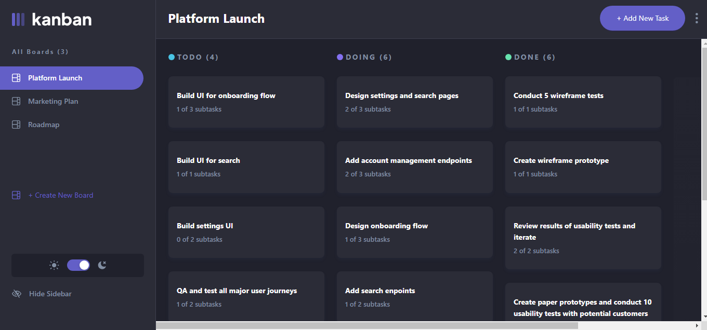

# Kanban Task Management

## Table of contents

- [Overview](#overview)
  - [The challenge](#the-challenge)
  - [Screenshot](#screenshot)
  - [Links](#links)
- [My process](#my-process)
  - [Built with](#built-with)
- [Author](#author)

## Overview

### The challenge

This is a solution to a fullstack project (Kanban task management) challenge on [Frontend Mentor](https://www.frontendmentor.io/challenges/kanban-task-management-web-app-wgQLt-HlbB) (they provide the design and assets and the gaol is to produce an app).

Users are able to:

- View the optimal layout for the app depending on their device's screen size
- See hover states for all interactive elements on the page
- Create, read, update, and delete boards and tasks
- Receive form validations when trying to create/edit boards and tasks
- Mark subtasks as complete and move tasks between columns
- Hide/show the board sidebar
- Toggle the theme between light/dark modes
- Keep track of any changes, even after refreshing the browser

### Screenshot

### Links

- Solution URL: [here](https://github.com/mmajudith/kanban-task-management)
- Live Site URL: [here](https://kanban-task-management-zeta.vercel.app/)

## My process

### Built with

- [React](https://reactjs.org/) - JS library
- [Next.js](https://nextjs.org/) - React framework
- [Typescript](https://typescriptlang.org) - Superset of JavaScript
- [Redux Toolkit](https://redux-toolkit.js.org/) - State management
- [Ant Design](https://ant.design/) - For styles
- [Firebase](https://firebase.google.com/) - For database

## Author

- Website - [Judith Onyekwelu](https://judith-portfolio.vercel.app/)
